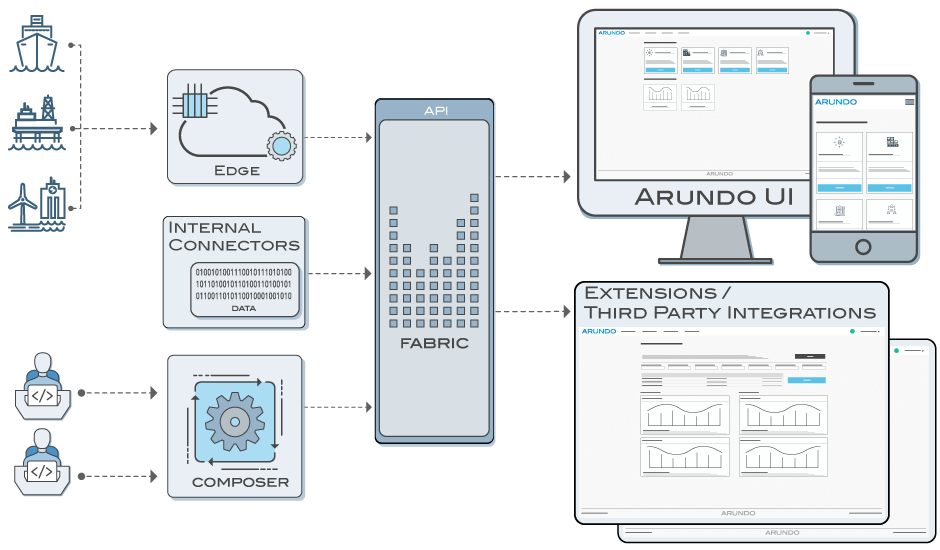

### Overview

The Arundo Platform provides core services that enable developers and data scientists to capture data at the edge, stream it into the cloud, and deploy machine learning models to discover insights on that data.

During my time at Arundo I contributed to the Arundo platform in three main ways:

1. **Developer**: I assisted in developing the CLI tool "composer" and Model Management services that enabled Data Scientists to easily build and deploy machine learning models to the cloud. Additionally, I assisted in building out streaming data services.

2. **Project Manager**: I acted as project manager to integrate and publish the Arundo Platform into the DNV GL Veracity Platform as their first third party app on their marketplace.

3. **Product Manager**: Eventually I became product manager over the Arundo Platform, overseeing direction for the various API services it offered, including:
   - Identity
   - Tag and Data Management
   - Model Management

---

_More information to come!_
