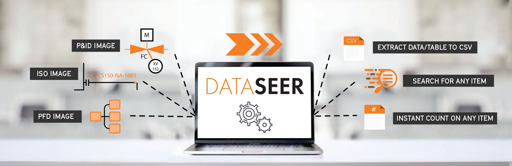

### Overview

DataSeer is an SaaS, B2B web application that automatically detects and labels data from piping & instrumentation (P&ID) and other engineering diagrams, lists and reports. It was built in close partnership with a leading engineering firm to inform design and optimize value for both customer and user.

I was Product Manager on DataSeer during my time with Arundo.

---

_More information to come!_
