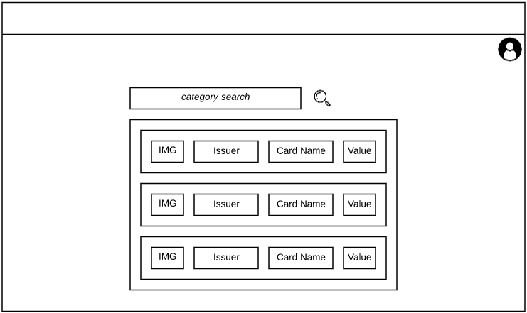

### Overview

I keep tabs on my airlines frequent flier miles and credit card reward points.
Sometimes though, it's difficult to keep track of all of them, or to
understand what is the optimal usage of points. There are different tools one could build to help with this, and I've been considering a few.

For this project, I decided to simply explore the relationship between purchases and reward categories. I used this idea as the basis to create an app to also try out some other tools I wanted more experience on.

### Desired Outcomes

The main **goals** for this project were:

1.  to understand further how credit card reward categories work
1.  get more practice on React structure and implementation
1.  explore Firebase offerings

**Objectives** include:

- Create an offering that identifies the optimal credit card that a user should use for a given purchase
- Understand further how credit card rewards are applied
- Implement site using React
- Host site on Firebase
- (optional) Use Firebase functions/database elements as appropriate

### Design

I sketched up a very simple wireframe in Lucidchart to outline how I'd like the information to be presented and how to structure the React components.

I didn't dwell on design too much as I didn't intend to release this prototype.

### Development

The main difficulty in development was actually gathering and associating the data. Reward programs use Merchant Category Codes (MCC) to categories purchases and award reward points. However, each company and even card might do this in a different way.

I implemented a two-tier data strcuture with Groups being comprised of a certain set of MCCs. So, for example, "Chase Travel" includes airline MCCs (3000-3500), hotel MCCs, car rental MCC, etc...

Even with the categories work done, I was still left with the problem of associating purchases with a specific category. For now I left that to the user, but this presents a problem as most users would not understand the MCC system. I'll have to find a better way for future efforts.

### Future

Moving forward, I could continue to build out this credit card recommender, but I'm not sure that it provides much value. I'd be more interested in creating some way of analyzing purchase history and perhaps desired budget and then recommending an ideal set of cards.
