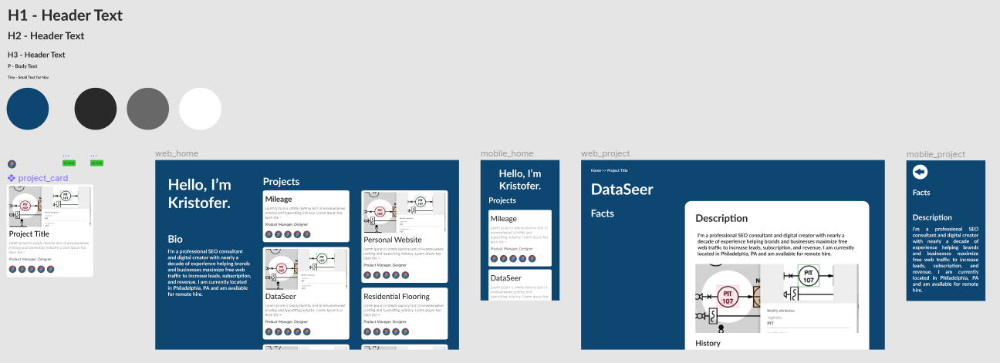

### Overview

During my job search I was looking for ways to better convey who I am and what I've done in the past. Resumes are pretty formulaic, and I'm not sure that cover letters are effective. Often applicants are asked to provide links to sites relevant to the application and themselves. This was a great opportunity to add that additional information.

Also during this time I was building a website for an architectural firm that used a lot of frameworks. I had the itch to explore using raw HTML and CSS, so this was the perfect opportunity for that.

### Desired Outcomes

The main **goals** were twofold:

1. Better convey to potential employers my passion and pedigree for digital product discovery and delivery
1. Brush up on the current state of basic HTML and CSS

The **objectives** then were to establish a website that:

1. Provides a portfolio of my projects
1. Shows more personality than a formal resume or cover letter might give
1. Website should be written with no JS (or as little as possible)

### Design

Design went pretty quick in Figma. The information architecture was rather simple, so there's no need for a lot of navigation elements or structure. I just wanted a simple intro page that gave an overview of what I've done, with an option to double click into more information.



I did want to convey my broad range of experience, so I included the different roles I've played and the tools I've used in these top project cards.

### Development

Before diving into development I brushed up on HTML and CSS with [freeCodeCamp](https://www.freecodecamp.org/learn)'s certificate course "Responsive Web Design". With that done, I started putting together the site, creating the raw HTML and CSS files.

#### Deployment and Hosting

With the overview page completed I wanted to get the site out there for feedback and to ensure there wouldn't be any issues that I needed to be aware of during development. Earlier I didn't really spend time planning how I'd host the site as there are a lot of options these days. I quickly found [Github Pages](https://pages.github.com/) and decided to use that, as I was using Github anyway. Deployment and hosting was pretty much automatic one I changed the repo name.

I wanted to use a custom domain name for a more professional presentation, so I bought _kristofer.site_ from (Domain.com)[https://domain.com] and hooked that up.

#### Templating

When creating the main page I just copy/pasted the Project cards and their subcomponents as I was only working with three of them and there wasn't much HTML. As I started to build out the project pages however I quickly realized that this wouldn't be tenable, and needed to implement some templating system to save a lot of headache. After a bit of research Jekyll looked like the right tool.

Now, after implementing Jekyll, I've kept "project" and "tool" information in data files, accessible anywhere. The "project card" is a reusable component that dynamically generates based on entries in the Projects data file. Icons for "role" and "tool" icons are also components, as I need to use these on the project cards and in the project detail pages themselves. The project details pages incorporate a templated layout, and I just need to write up the descriptions in markdown for each. This saved me a lot of time in adding new projects, roles and tools, and in iterating on design.

#### Deployment and Hosting, pt. 2

With the incorporation of Jekyll I ran into another problem. The free Github Pages service requires _index.html_ to be in the root of the repo. However, Jekyll builds out a `_site` subdirectory. After trying various build / deploy configs on both Jekyll and Github, the simplest solution was to simply create a separate Jekyll repo with it's `_site` directory being a submodule pointing to the website main repo.

Jekyll repo simplified structure:

```
.
├── _site  // Submodule pointing to main site repo!
└── index.html
```

### Future Work

- Add more content (projects, project details, etc...)
- Track traffic to site
