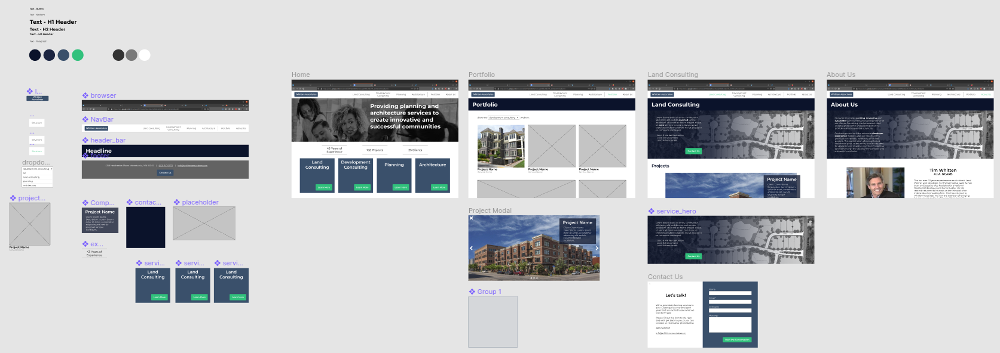

### Overview

Whitten Associates, an architectural firm that I have a personal relationship to, was looking to create a new website. They had received feedback that a more polished and up-to-date site would serve them better. My brother, (Erik Maanum)[] was planning to undertake the development.

I've been wanted to explore design a bit more deeply and this presented a great opportunity to do so. I offered to design the site and assist with development, and they accepted.

### Desired Outcomes

#### Whitten Associates

The client expressed the desire to have a more polished website. After further discussion it was clear that the main **goal** was to increase the likelihood that potential clients contact the company to start discussions on services. So the main **objective** is:

- Increase lead gen conversion rate (% of site visitors that end up contacting the company) (understanding that we don't have the current conversion rate number)

#### Personal

For my end, I wanted to explore the design process a bit better, especially in understanding the client and audience and how best to create an experience that provides business value. Also, I've always been interested in UX and wanted to learn the tools and try my hand at creating this experience. **Objectives** for me were:

- Understand the business value websites provide and how, quantitatively, to measure their efficacy
- Learn how to use Figma

### Design

Whitten Associates offer four main types of services:

- Land Consulting
- Development Consulting
- Architecture
- Planning

I wanted to provide a simple, flat site structure that:

1. Drives the user to select which service they are interested in
2. Provides the user confidence that Whitten Associates is right for them
3. Drives the user to contact Whitten Associates

Additionally, Whitten Associates is a smaller firm that provides more personal service, and I wanted to convey that in the design.

Finally, a portfolio is often expected on a design site, but as a secondary option rather than the primary way we want to direct traffic.

### Development

Tech lead [Erik Maanum](https://www.linkedin.com/in/erik-maanum-2776a442) opted to use Sanity.io as a CMS to make it easy and intuitive for the client to update and add content to the website. Gatsby will be used to generate the site.

Work is now underway to build and deploy the website.

### Metrics

_More information to come later!_
